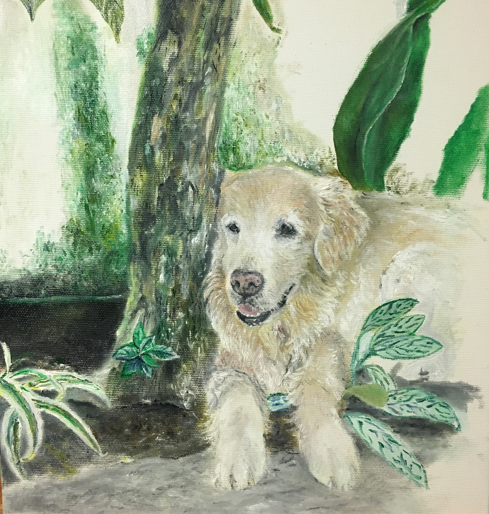
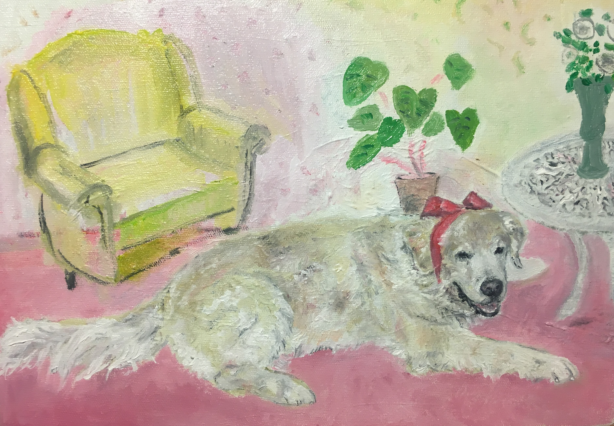
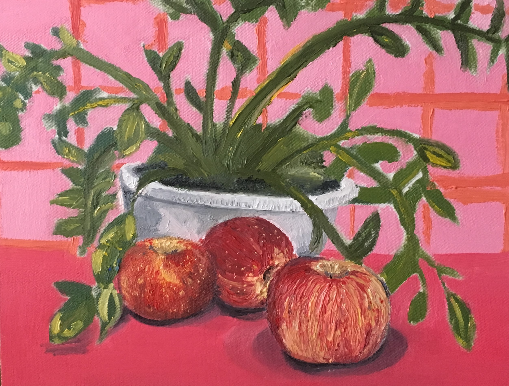

## Hello!
---
25 years old. Based in Turin, Italy.
 
Currently a second-year Masters student of Economics at Lund University.

### Writing Samples

[Blurred Lines: the effect of electing a party with
religious links on Reproductive and Neonatal Health](/pdf/NEKN51_Isabella_Rego_Monteiro_Forest_Concessions_Brazil(2).pdf)
 
My term paper for a class on Economic Evaluation at Lund.

[Cost-benefit analysis of Forest Concessions in the
Brazilian Legal Amazon](/pdf/17916-113-other_document-1030498556.pdf)
 
My term paper for a class on Economic Evaluation at Lund.

[The Effects of Fertility on Intrahousehold Resource Allocation and Women's Bargaining Power - Evidence from Nigeria](/pdf/Essay_Isabella_Rego_Monteiro_19971128_T726_NEKN01.pdf)
 
My first year's Master's Thesis.

---
[The effect of children’s school starting age on women’s
labor supply - evidence from Brazil’s Curriculum reform](/pdf/Labor_Economics_Assignment.pdf)
 
An original empirical paper for the Advanced Labour Economics class in my Master's Degree.

---
[An overview of risk and consumption smoothing
mechanisms in rural Mozambique](/pdf/Monografia.pdf)
 
My Bachelor's Thesis.

---

 

### Simple Coding Samples

<a href="https://github.com/isabellarmonteiro/isabellarmonteiro.github.io/blob/master/data_analysis_women_25_05_2022.do"> Stata - data analysis conducted for my first Master's Thesis </a>
   
<a href="https://github.com/isabellarmonteiro/isabellarmonteiro.github.io/blob/master/GIS_Violence-and-Econ-Activity_2022_06_15.R"> R - Spatial Analysis </a> , yielding  [this](/pdf/Rplot18.pdf) outcome relating number of deaths by violent conflict and night lights/economic activity in Burkina Faso.

---
 

### Teaching

#### Academic
In 2020, I had the rewarding opportunity of becoming the teaching assistant for PUC-Rio's undergraduate Development Economics course during two academic semesters. Each semester, I gave weekly lectures to approximately 70 students with the objective of deepening their knowledge of the literature and their ability to apply the economic development theories in practice. Find below the recording of one of the lectures, which were published online and kept available at the professors' request.

<iframe width="560" height="315" src="https://www.youtube.com/embed/2o-Fuhr7ZCs" title="YouTube video player" frameborder="0" allow="accelerometer; autoplay; clipboard-write; encrypted-media; gyroscope; picture-in-picture" allowfullscreen></iframe>
   

#### Public Sector
During that same year, I also became a teaching assistant for two <a href="https://prefeitura.rio/cidade/servidores-terao-formacao-em-metodologia-para-resolucao-de-problemas-complexos"> capacity building courses </a> aimed at strengthening the implementation capacity of public servants in Brazil. The first course was given to teams within different departments of Rio de Janeiro's City Hall, while the second one was given to teams working at the Brazilian Institute of Geography and Statistics (IBGE). 

   
---

## On a more personal note...
---
### Languages
Currently focusing on improving my Swedish and learning the basics of Indonesian.

---
### Some Paintings
 
 

              
 
 
      
    
      

---
### Animated Videos

In 2021, I created my first animated project: a promotional video for the capacity building courses that we were giving to public servants in Rio de Janeiro's city hall. The story focuses on the Tanager's important role as a seed spreader in spite of his small size, highlighting how the small and medium-scale projects that our students were developing would eventually translate into larger-scale change in Rio de Janeiro's status quo.

<iframe width="560" height="315" src="https://www.youtube.com/embed/PNKy8NNBTls" title="YouTube video player" frameborder="0" allow="accelerometer; autoplay; clipboard-write; encrypted-media; gyroscope; picture-in-picture" allowfullscreen></iframe>

---

---

Page template forked from <a href="https://github.com/evanca/quick-portfolio">evanca</a>

<!-- Remove above link if you don't want to attibute -->
